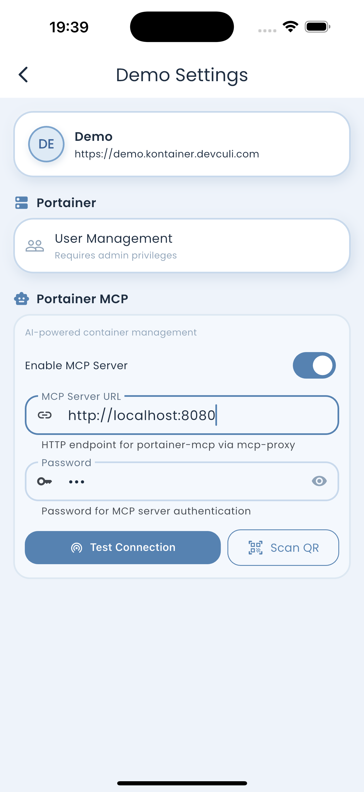

# Portainer MCP HTTP Server

It's just a wrapper of [portainer-mcp](https://github.com/portainer/portainer-mcp) that allows you to access Portainer via an HTTP client.

## How It Works

```
┌─────────────────────────────────────────────────────────────────────────────┐
│                          YOUR INFRASTRUCTURE                                 │
│                                                                              │
│   Kontainer App                  portainer-mcp-server         Portainer     │
│   (your phone)                   (your server)                (your server) │
│                                                                              │
│   ┌─────────────┐                ┌────────────────────┐      ┌───────────┐ │
│   │             │   HTTPS/SSE    │                    │      │           │ │
│   │  Connect    │───────────────▶│  Receive requests  │─────▶│  Docker   │ │
│   │             │                │  Forward to MCP    │      │  Swarm    │ │
│   │  Control    │◀───────────────│  Return results    │◀─────│  K8s      │ │
│   │             │   Responses    │                    │      │           │ │
│   └─────────────┘                └────────────────────┘      └───────────┘ │
│                                                                              │
│   ● Your data stays on your servers                                          │
│   ● Your credentials never leave your infrastructure                         │
│   ● No third-party services involved                                         │
│                                                                              │
└─────────────────────────────────────────────────────────────────────────────┘
```

### Data Flow

1. **You run the server** on your machine/VPS next to Portainer
2. **App connects** to your server with password authentication
3. **Server forwards** requests to Portainer via MCP
4. **Results return** directly to your app

Your Portainer API token and password never leave your infrastructure.

## Installation

### Option 1: Auto-Install Script

```bash
# Install latest version (v0.7.0)
curl -fsSL https://raw.githubusercontent.com/1buck/portainer-mcp-http-server/main/install.sh | bash

# Install specific version
curl -fsSL https://raw.githubusercontent.com/1buck/portainer-mcp-http-server/main/install.sh | bash -s -- --version v0.7.0

# Show all options
curl -fsSL https://raw.githubusercontent.com/1buck/portainer-mcp-http-server/main/install.sh | bash -s -- --help
```

**Script Features:**
- ✅ Auto-detects OS and architecture
- ✅ Downloads correct binary for your platform
- ✅ Installs to `/usr/local/bin` (or custom location)
- ✅ Creates `portainer-mcp-server` symlink
- ✅ Supports reinstallation with `--force`
- ✅ Verifies download integrity

---

### Option 2: Docker (Recommend)

```bash
docker run -d \
  -p 8080:8080 \
  -e PORTAINER_URL=https://portainer.example.com \
  -e PORTAINER_TOKEN=your-token \
  -e MCP_PASSWORD=your-password \
  -e MCP_BASE_URL=192.168.1.50:8080 \
  -e MCP_READ_ONLY=false \
  -e MCP_DEBUG=false \
  ghcr.io/1buck/portainer-mcp-server:latest
```
---

### Option 3: Docker Compose (Recommend)

```yaml
version: '3.8'
services:
  portainer-mcp-server:
    image: ghcr.io/1buck/portainer-mcp-server:latest
    ports:
      - "8080:8080"
    environment:
      - PORTAINER_URL=https://portainer.example.com
      - PORTAINER_TOKEN=your-token
      - MCP_PASSWORD=your-password
      - MCP_BASE_URL=192.168.1.50:8080
      - MCP_READ_ONLY=false
      - MCP_DEBUG=false
      - MCP_SKIP_VERSION_CHECK=false
```
---

### Option 4: Build from Source

```bash
git clone https://github.com/1buck/portainer-mcp-http-server.git
cd portainer-mcp-http-server
go build -o portainer-mcp-server .
```

## Usage

### Binary

The binary is **self-contained** - it automatically extracts and uses the bundled `portainer-mcp` binary on supported platforms.

```bash
# Basic usage
./portainer-mcp-server \
  -portainer-url http://localhost:9000 \
  -portainer-token YOUR_TOKEN \
  -password YOUR_PASSWORD \
  -base-url 192.168.1.50:8080

# All options
./portainer-mcp-server \
  -portainer-url http://localhost:9000 \
  -portainer-token YOUR_TOKEN \
  -password YOUR_PASSWORD \
  -listen :8080 \
  -base-url 192.168.1.50:8080 \
  -mcp-path /usr/local/bin/portainer-mcp \
  -read-only false \
  -skip-version-check false \
  -debug false \
  -use-http false
```

**Binary Resolution:** The server will:
1. Use the bundled `portainer-mcp` binary (automatically extracted to temp directory)
2. Fall back to searching PATH for `portainer-mcp` if bundled binary is not available
3. Use explicit path if `-mcp-path` flag is provided
### Docker / Docker Compose

Environment variables map to flags:

| Environment Variable | Flag | Example | Default |
|---------------------|------|---------|---------|
| `PORTAINER_URL` | `-portainer-url` | `http://portainer:9000` | (required) |
| `PORTAINER_TOKEN` | `-portainer-token` | Your API token | (required) |
| `MCP_PASSWORD` | `-password` | Your password | (required) |
| `MCP_BASE_URL` | `-base-url` | `192.168.1.50:8080` | Auto-detected |
| `MCP_LISTEN` | `-listen` | `:8080` | `:8080` |
| `MCP_PATH` | `-mcp-path` | `/usr/local/bin/portainer-mcp` | `portainer-mcp` |
| `MCP_READ_ONLY` | `-read-only` | `true` or `false` | `false` |
| `MCP_SKIP_VERSION_CHECK` | `-skip-version-check` | `true` or `false` | `false` |
| `MCP_DEBUG` | `-debug` | `true` or `false` | `false` |
| `MCP_USE_HTTP` | `-use-http` | `true` or `false` | `false` |

## Configuration

### Required Flags

| Flag | Description | Example |
|------|-------------|---------|
| `-portainer-url` | Your Portainer URL | `portainer.example.com` or `192.168.1.100:9443` |
| `-portainer-token` | Portainer API token | Get from Portainer → Settings → API Tokens |
| `-password` | Password for app authentication | Any password you choose |

### Optional Flags

| Flag | Description | Default | Env Variable |
|------|-------------|---------|--------------|
| `-listen` | Server listen address | `:8080` | `MCP_LISTEN` |
| `-base-url` | **Public URL for QR code and SSE** (e.g., `192.168.1.100:8080`, hostname, or full URL) | Auto-detected from hostname | `MCP_BASE_URL` |
| `-mcp-path` | Path to portainer-mcp binary | `portainer-mcp` | `MCP_PATH` |
| `-read-only` | Disable write operations | `false` | `MCP_READ_ONLY` |
| `-skip-version-check` | Skip Portainer version check | `false` | `MCP_SKIP_VERSION_CHECK` |
| `-debug` | Enable debug logging | `false` | `MCP_DEBUG` |
| `-use-http` | Use HTTP instead of HTTPS (dev only) | `false` | `MCP_USE_HTTP` |

## Connecting from Kontainer App

1. Start server
2. In Kontainer app
   - Go to instance setting screen
   - Scan QR code generated in console or manually input url and password
3. Test and save connnection




### Download Kontainer App
* Android: https://play.google.com/store/apps/details?id=com.devculi.kontainer
* IOS: https://apps.apple.com/us/app/portainer/id6742278087

<p align="center">
  <a href="https://play.google.com/store/apps/details?id=com.devculi.kontainer">
    
  </a>
  <a href="https://apps.apple.com/us/app/portainer/id6742278087">
    
  </a>
</p>


## Nginx Proxy Configuration

**✅ Update (v0.7.1+): The server now handles nginx compatibility automatically!**

The server sends `X-Accel-Buffering: no` header and SSE heartbeats (30s interval), which tells nginx to:
- Disable buffering for SSE streams automatically
- Keep connections alive through nginx idle timeout

**No nginx configuration changes required** for most nginx proxy setups. Just deploy the server behind nginx and it should work.

### When You Still Need Manual Nginx Config

If you still experience connection issues after deploying v0.7.1+, add this to Nginx Proxy Manager's **Advanced** tab:

### Why It's Needed

SSE connections require:
- **No buffering** - Events must stream immediately, not be batched
- **Long timeouts** - Connections stay open for extended periods
- **HTTP/1.1** - Required for chunked transfer encoding

### Nginx Proxy Setup

In Nginx Proxy, add this to your proxy host:

```nginx
# SSE endpoint - CRITICAL for streaming
location /sse {
    proxy_pass http://YOUR_BACKEND_IP:PORT;
    
    # MUST HAVE - Disable buffering for SSE
    proxy_buffering off;
    proxy_cache off;
    proxy_max_temp_file_size 0;
    
    # MUST HAVE - HTTP/1.1 for streaming
    proxy_http_version 1.1;
    proxy_set_header Connection '';
    
    # Standard headers
    proxy_set_header Host $host;
    proxy_set_header X-Real-IP $remote_addr;
    proxy_set_header X-Forwarded-For $proxy_add_x_forwarded_for;
    proxy_set_header X-Forwarded-Proto $scheme;
    
    # MUST HAVE - Prevent timeout (24 hours)
    proxy_read_timeout 86400s;
    proxy_send_timeout 86400s;
    
    # Clean chunk handling
    chunked_transfer_encoding off;
}

# Message endpoint - normal timeout OK
location /mcp/message {
    proxy_pass http://YOUR_BACKEND_IP:PORT;
    
    proxy_http_version 1.1;
    proxy_set_header Host $host;
    proxy_set_header X-Real-IP $remote_addr;
    proxy_set_header X-Forwarded-For $proxy_add_x_forwarded_for;
    
    # Normal timeout for RPC calls
    proxy_read_timeout 60s;
    proxy_send_timeout 60s;
}

# Connect endpoint (for testing)
location /connect {
    proxy_pass http://YOUR_BACKEND_IP:PORT;
    
    proxy_http_version 1.1;
    proxy_set_header Host $host;
    proxy_set_header X-Real-IP $remote_addr;
    proxy_set_header X-Forwarded-For $proxy_add_x_forwarded_for;
}
```

### Common Issues

| Issue | Cause | Fix |
|-------|-------|-----|
| Connection closes after 60s | Default `proxy_read_timeout` | Set to `86400s` |
| Events don't stream | `proxy_buffering on` (default) | Set `proxy_buffering off` |
| "Invalid session" errors | SSE closed, session invalidated | Fix timeout + buffering |
| Double chunking errors | Nginx re-encoding chunks | Set `chunked_transfer_encoding off` |

## License

MIT
